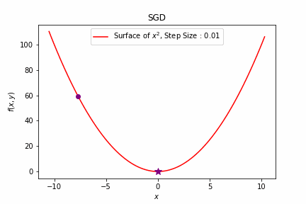
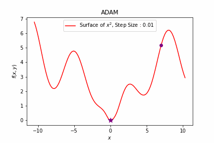

# Visualization of Deep Learning Optimization Algorithms using PyTorch

This repository contains the code for visualization of various deep learning optimization algorithms. PyTorch is used for automatic differentiation and implementing the various optimizers.

### Stochastic Gradient Descent (SGD)

|     2D Convex Surface      |     2D Non-Convex Surface      |  3D Surface with Saddle Point  |
| :------------------------: | :----------------------------: | :----------------------------: |
|  |  |  |

### SGD with Momentum

|            2D Convex Surface            |        2D Non-Convex Surface        |    3D Surface with Saddle Point     |
| :-------------------------------------: | :---------------------------------: | :---------------------------------: |
|  |  |  |

### Adaptive Moment Estimation (ADAM)

|      2D Convex Surface      |      2D Non-Convex Surface      |  3D Surface with Saddle Point   |
| :-------------------------: | :-----------------------------: | :-----------------------------: |
|  |  |  |

### Ada-delta

|        2D Convex Surface        |        2D Non-Convex Surface        |    3D Surface with Saddle Point     |
| :-----------------------------: | :---------------------------------: | :---------------------------------: |
|  |  |  |

### Ada-grad

|       2D Convex Surface        |       2D Non-Convex Surface        |    3D Surface with Saddle Point    |
| :----------------------------: | :--------------------------------: | :--------------------------------: |
|  |  |  |

### Nesterov Accelerated SGD

|        2D Convex Surface        |        2D Non-Convex Surface        |    3D Surface with Saddle Point     |
| :-----------------------------: | :---------------------------------: | :---------------------------------: |
|  |  |  |
